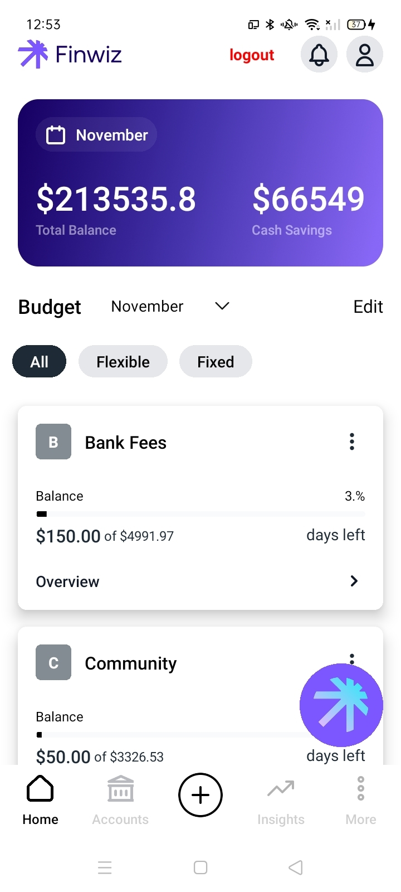

# 💰 FinWiz - Smart Financial Management App

FinWiz is a **finance management** platform built with **Laravel 7, React Native, and PHP 7.4**, designed to help users track their spending and achieve financial goals. Users can securely **connect their bank accounts via Plaid**, categorize transactions, receive AI-driven spending recommendations, and interact with an AI assistant for financial insights.

## 📌 Preview

---

## 🛠 Tech Stack & Versions

- **Backend:** Laravel 7, PHP 7.4
- **Frontend:** React Native
- **Database:** MySQL
- **AI Integration:** AI-powered financial assistant
- **Bank Integration:** Plaid API
- **Server:** AWS (Managed via Forge)
- **Others:** JavaScript, GitHub

---

## 🎯 Features

### **🏦 Bank Account Integration**
- Securely connect bank accounts via **Plaid API**.
- Fetch and sync transaction history in real-time.

### **📊 Transaction Categorization**
- Automatically categorize transactions (e.g., **Food, Rent, Shopping**).
- View spending insights across different categories.

### **🎯 Smart Financial Recommendations**
- Get personalized recommendations to optimize spending.
- AI-driven analysis to **achieve future financial goals**.

### **🤖 AI Financial Chat Assistant**
- Ask AI about financial insights, budgeting, and investment tips.
- AI provides **smart suggestions** based on spending behavior.

---

## 🌍 External Integrations
- **Plaid API** – Secure bank account linking and transaction data.
- **AI Chatbot** – Personalized financial guidance.
- **AWS + Forge** – Scalable hosting and deployment.

---

## 🚀 Setting Up Local Environment & Prerequisites

### **📂 GitHub Repo Structure**
- **Master:**  Live Server
- **Develop:**  Dev Server
- **Branch from Develop:** Task-wise branches

---

## Developer Information

- **Developer Email:** iabdullahh.dev@gmail.com
